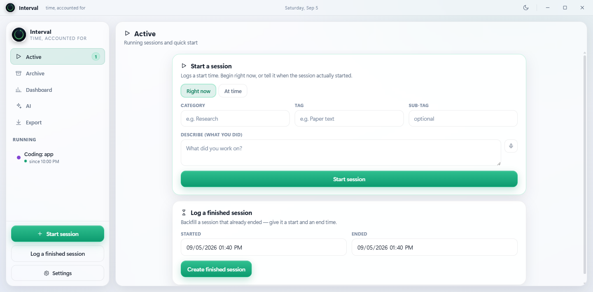
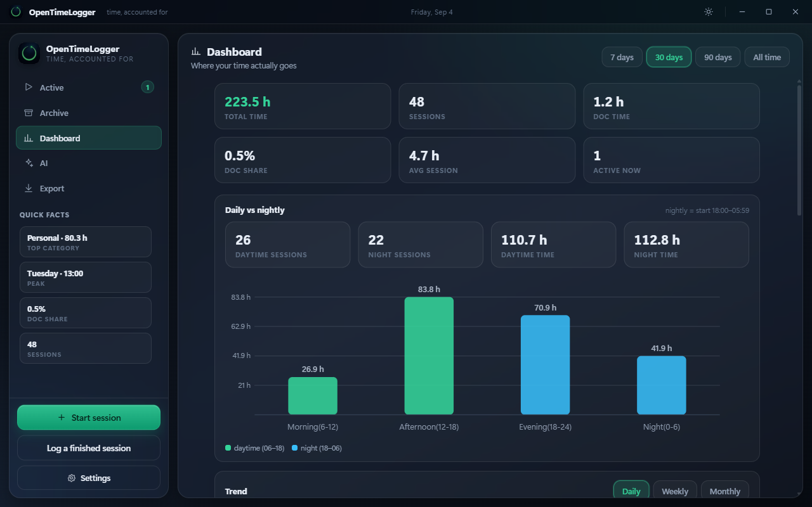
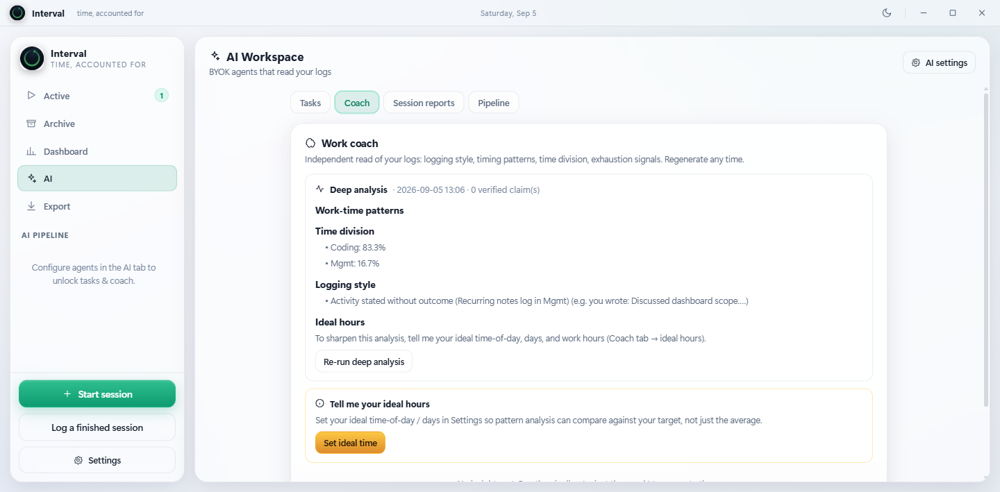

<div align="center">

# Interval

**A modern desktop time tracker with an analytics dashboard and an optional BYOK AI workspace — every session stays on your disk.**


</div>

---

Interval is a small, private-by-design desktop app for logging what you work on. Start and stop sessions with a click — or backfill when they *actually* started and ended — and let it silently measure how long you spend writing each session's notes. Everything lives in readable JSON next to the app, one click turns any date range into a filtered Excel workbook, the **Dashboard** shows where your time actually goes, and the **AI workspace** (bring your own API key) turns your logs into tasks, timelines and coaching.

No accounts. No cloud. No telemetry. Your time is your file.

---

## Screenshots

<div align="center">

| Start a session | Dashboard | AI workspace |
|:---:|:---:|:---:|
|  |  |  |

</div>

---

## Features

- **Start & end, now or at a time** — begin right away, or tell it the moment a session *actually* started and finished.
- **Overlapping sessions** — run several sessions in parallel; each is tracked independently.
- **Active / Archive side menu** — running sessions on one side, finished ones in the archive. Archive entries are fully editable: times, category, tag, sub-tag, description, notes — and can be reopened into Active.
- **`category: tag + sub-tag` naming** — sessions are named `Category: tag + sub-tag`. Category, tag and description are essential; sub-tag and notes are optional. You can also name a session up front when you start it.
- **Automatic documentation tracking** — the app measures the time you spend writing a session's documentation and logs it on the session. At the end of each day it sums documentation time **per category** into a single `documentation`-tagged summary record, so you can see exactly how much time went into writing things up.
- **Analytics dashboard** — daily vs nightly counts and hours, daily/weekly/monthly trends, per-category breakdown with sub-category drilldown (plus per-category trend), documentation/work ratio trends, hour × weekday heatmaps (global and per-category), session-length distribution and weekly rhythm. All computed locally from `sessions.json`.
- **AI workspace (BYOK, opt-in)** — three agents (Session Analyzer → Task Builder → Work Coach) run on *your* API keys across Mistral AI, OpenRouter, OpenAI, AvalAI and Google AI Studio. Animated agent graph, per-agent provider/key/model setup with model testing, automatic fallback to the nearest-price model, task timelines with challenges (severity + solved/partially-solved status), step ↔ timelog mapping, check-in/check-out propositions (consent-gated DPO dataset export), a work coach (logging style, timing patterns, time division, exhaustion signals) and English voice dictation (WER-gated ASR models only).
- **Excel export** — filter finished sessions by category, tag and date range (Today → All time) and export a styled `.xlsx`. When a single category is selected, the Category column is dropped automatically.
- **Private by design** — local JSON files next to the app; close the window and the process exits. Nothing leaves your machine.

## Getting started

### Option A — run the prebuilt app

Grab `OpenTimeLogger.exe` from the [Releases](../../releases) page and double-click it. No Python required.

> Requires the WebView2 runtime, which ships with Windows 10 and Windows 11.

### Option B — run from source

Requires Python 3.11+ on Windows.

```bash
git clone https://github.com/AAhmadS/OpenTimeLogger.git
cd OpenTimeLogger
pip install -r requirements.txt
pythonw session_logger.py     # or: python session_logger.py
```

### Building the standalone `.exe`

```bash
pip install pyinstaller
pyinstaller --noconfirm --clean OpenTimeLogger.spec
```

The onedir bundle lands in `dist/OpenTimeLogger/`. (Onedir is deliberate: onefile
extracts to `%TEMP%` on every launch — slower start, antivirus rescans and orphaned
temp dirs. Unused webview backends are excluded in the spec to keep it lean.)

## How it stores data

| File | Purpose |
| --- | --- |
| `sessions.json` | Every session and the daily documentation summaries. Created next to the app on first run. |
| `ai_config.json` | Your AI providers, keys (plaintext, local disk only), per-agent models, ASR + ideal-hours settings. |
| `tasks.json` / `insights.json` / `ai_reports.json` | AI-generated tasks, coach insights and per-session reports. |
| `dpo_dataset.jsonl` | Proposition preference rows — only written when you consent, for DPO training. |
| `exports/*.xlsx` | Excel workbooks produced by the export feature. |

`sessions.json` is plain JSON — readable, editable, and easy to back up or migrate. Old-format files from earlier versions are migrated automatically on first launch.

## Project structure

```
Interval/
├── session_logger.py    # backend: session logic, Excel export, AI bridge, webview host
├── ui.py                # the entire UI (HTML/CSS/JS) embedded as a string
├── store.py             # paths (OTL_APP_DIR-aware), JSON store, traversal guard, logging
├── timelib.py           # timestamp parsing/formatting/durations (single home)
├── export_xlsx.py       # 4-sheet workbook builder, filters, export naming
├── analytics.py         # stdlib-only dashboard aggregations over sessions.json
├── ai.py                # BYOK providers, agent pipeline, tasks/insights store, ASR, fallback
├── aigraph.py           # agent graph: change detection, parts, tasks, coach, scheduler
├── models.py            # live provider catalog, 4D pricing, cost estimator
├── keystore.py          # OS credential-locker backend (ctypes, stdlib-only)
├── audio_capture.py     # microphone capture (sounddevice) for dictation
├── brand.py             # generated avatar, embedded as a data URI
├── app.ico              # application icon (Seedream 5 logo, multi-size)
├── assets/              # logo, avatar & icon sources
├── requirements.txt
└── screenshots/         # this README's screenshots
```

## Contributing

Interval is a tiny, focused project — good first contributions:

- Linux/macOS support (the UI is platform-neutral; only the webview host and build are Windows-tuned)
- A CSV export option
- iCal / calendar feeds from archived sessions
- Weekly roll-up reports (monthly, weekly views)

Open an issue before a large change so we can agree on direction.

## License

[MIT](LICENSE) © 2026 Amirahmad Shafiee

## Credits

- [pywebview](https://pywebview.flowrl.com) — native window + webview host
- [openpyxl](https://openpyxl.readthedocs.io/) — Excel export
- [WaveSpeed](https://wavespeed.ai) / ByteDance Seedream 5.0 Pro — app logo
- [xiaomi/mimo-v2.5](https://openrouter.ai) — UI review of the rendered app